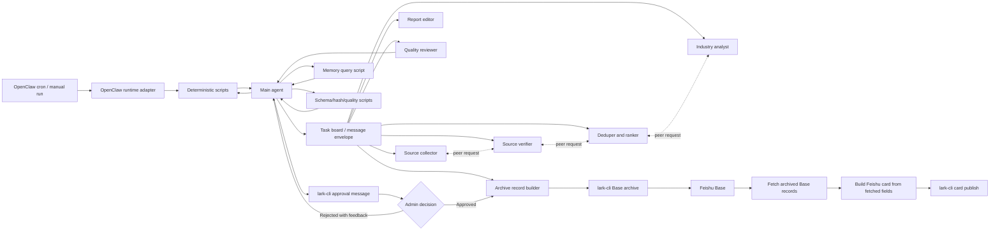

# Architecture

## Goal

Build an OpenClaw scheduled AI news workflow that coordinates deterministic scripts and multiple specialist subagents, requests human approval in Feishu, archives approved content to Feishu Base, builds a Feishu card from archived Base data, and publishes the card to a Feishu group.

The architecture follows one rule: scripts execute deterministic events, agents decide uncertain events. The main agent stitches inputs together, calls scripts, reads structured results, and chooses the next action.

## Component View



## Main Agent Responsibilities

The main agent is the only role allowed to advance workflow state. It owns:

- OpenClaw run context normalization.
- Deterministic script calls for schema validation, hashing, idempotency, payload freezing, Feishu API submission, and archive writes.
- Subagent task decomposition, message routing, dependency control, and retry policy.
- On-demand memory queries before assigning each role.
- Final quality review across all returned evidence.
- Human approval request and interpretation of approval callbacks.
- Archive authorization, card-build authorization, and publish authorization.
- Incident reporting when source access, Feishu APIs, or platform callbacks fail.

## State Machine

Use this explicit state machine for idempotency and recovery:

```text
scheduled
  -> collecting
  -> verifying
  -> ranking
  -> drafting
  -> internal_review
  -> approval_pending
  -> approved
  -> archiving
  -> card_building
  -> publishing
  -> completed
```

Rejection path:

```text
approval_pending -> rejected -> replanning -> collecting|drafting
```

Failure path:

```text
any_state -> failed_retriable -> same_state
any_state -> failed_terminal -> notify_admin
```

## Data Model

### RunContext

```json
{
  "job_id": "ai-news-2026-06-04-asia-shanghai",
  "platform": "openclaw",
  "trigger_type": "scheduled",
  "scheduled_at": "2026-06-04T09:00:00+08:00",
  "window_start": "2026-06-03T09:00:00+08:00",
  "window_end": "2026-06-04T09:00:00+08:00",
  "timezone": "Asia/Shanghai",
  "attempt": 1,
  "max_attempts": 3,
  "trace_id": "platform-trace-id",
  "approval_user_id": "ou_xxx",
  "publish_chat_id": "oc_xxx",
  "base_app_token": "base_xxx",
  "base_table_id": "tbl_xxx"
}
```

### NewsItem

```json
{
  "id": "stable_hash_of_primary_url_or_cluster",
  "headline": "string",
  "summary": "string",
  "category": "model|product|funding|policy|research|infra|enterprise|security|other",
  "region": "global|china|us|eu|other",
  "published_at": "ISO-8601",
  "primary_source_url": "https://...",
  "supporting_source_urls": ["https://..."],
  "entities": ["OpenAI", "Google DeepMind"],
  "impact_score": 1,
  "novelty_score": 1,
  "confidence": "high|medium|low",
  "verification_notes": "short evidence note",
  "risks": ["unconfirmed funding amount"]
}
```

## Collaboration Pattern

Use a shared task board with message envelopes. Every subagent return should be machine-readable first and prose second.

```json
{
  "job_id": "string",
  "from_role": "source_verifier",
  "to_role": "main_agent",
  "action": "assign_task|request_peer_input|peer_response|return_result|request_memory",
  "status": "ok|needs_input|blocked|failed",
  "payload": {},
  "evidence": [{"url": "https://...", "note": "why this supports the claim"}],
  "risks": [{"severity": "low|medium|high", "detail": "string"}],
  "next_request": "string or null"
}
```

Subagents may communicate through `request_peer_input` and `peer_response` envelopes. The main agent routes these messages and trims context so each role sees only the relevant item IDs, evidence, question, and answer.

## Quality Gates

The main agent must reject the draft before Feishu approval if any gate fails:

- Every item has a working primary source URL.
- Every item is within the configured date window or clearly marked as a follow-up.
- Important claims are supported by primary or highly credible secondary sources.
- Duplicate stories are clustered into one item.
- Headlines do not overstate the source evidence.
- The report has enough coverage diversity; avoid all items coming from one vendor unless the news day justifies it.
- Low-confidence items are either removed or placed in a clearly labeled "待确认" section.
- The final Feishu card is generated from archived Base fields, concise enough for group reading, and preserves source links.

## Retry and Replanning

Retry only the smallest necessary part:

- Source fetch failure: rerun collector with backup source channels.
- Verification failure: ask collector for alternative sources or remove the item.
- Reviewer failure: rerun editor with reviewer notes.
- Admin rejection: use administrator feedback as the primary replanning instruction.
- Feishu Base archive failure after approval: do not publish; retry archive and notify admin if it remains blocked.
- Feishu card build failure after archive: do not republish or rewrite Base records; fix card data or rerun card build.
- Feishu publish failure after card build: retry publishing with the same card hash and idempotency key.

Use `job_id + item_id` as the archive idempotency key and `job_id + card_hash` as the publish idempotency key.

## Observability

Log or persist these events:

- Run started and normalized context.
- Subagent task assignment and completion status.
- Candidate count, verified count, final item count.
- Internal review pass/fail reasons.
- Feishu approval request ID and callback decision.
- Feishu Base record IDs.
- Feishu card hash.
- Feishu group message ID.
- Failure reason, retry count, and terminal status.

## Deterministic Script Layer

Use scripts for:

- OpenClaw input normalization.
- Required field and schema validation.
- URL/date/window checks that can be computed from available data.
- Duplicate ID and payload hash generation.
- Idempotency key generation.
- Feishu approval/publish/archive API calls.
- Feishu message payload assembly when using fixed templates.
- Feishu Base record construction and write retries.
- Feishu Base record read-back and card construction from fetched fields.

Use agents for:

- Source discovery and source credibility judgment.
- Deciding whether secondary evidence is sufficient.
- Ranking importance when multiple credible items compete.
- Explaining why an item matters.
- Rewriting after admin feedback.

See [script-boundaries.md](script-boundaries.md) for the detailed division.

## Context And Memory

Do not load all references into every role. Treat memory as queryable context:

- Use `scripts/query_memory.py --query "<role topic>" --top-k 3` before creating a role envelope.
- Include only the returned snippets that directly affect the current role.
- Store full run outputs in OpenClaw run logs, Feishu Base, or a configured state store.
- Put only compact IDs and status summaries on the task board.
- Ask a second targeted query if a subagent needs more context.

## Security Boundaries

- Keep Feishu credentials in platform secrets, not in prompts or archived records.
- Store source evidence URLs and public facts only.
- Do not archive administrator private comments unless the organization explicitly wants rejection history in Base.
- Treat all card callback payloads as untrusted input; validate `job_id`, approver identity, payload hash, and expiry time before continuing.
