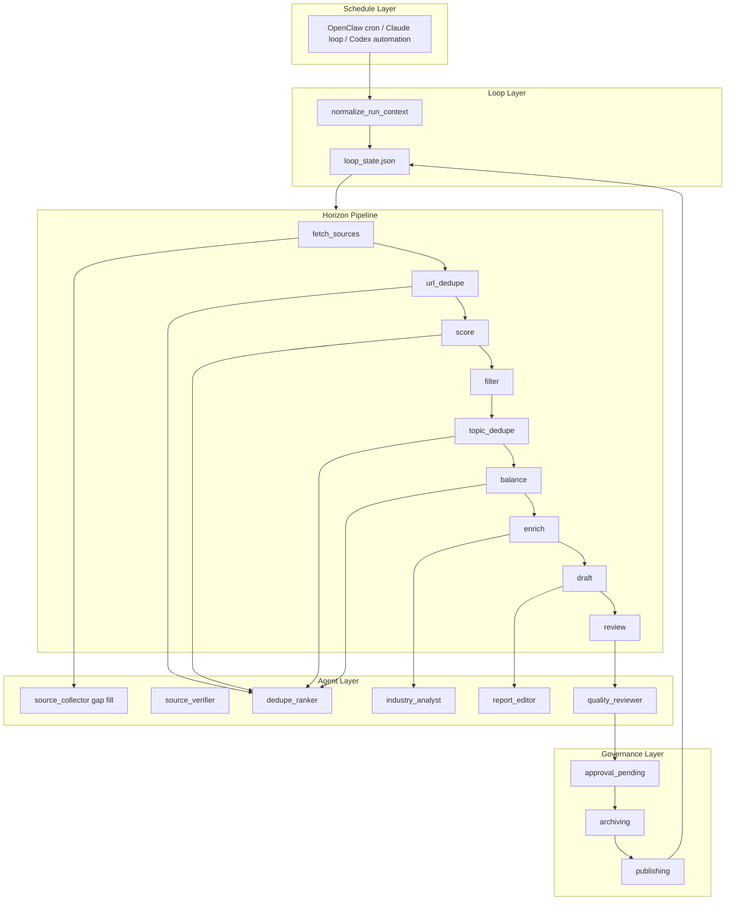

# Architecture

## Goal

Build a **loop-engineered**, **Horizon-inspired** daily AI news workflow that:

1. fetches and deduplicates multi-source candidates,
2. scores, filters, enriches, and drafts a Chinese report,
3. verifies with maker-checker subagents and deterministic scripts,
4. requests human approval in Feishu,
5. archives approved content to Feishu Base,
6. publishes a card built only from archived read-back data,
7. persists durable state in `loop_state.json` across platform runs.

Horizon reference: [github.com/Thysrael/Horizon](https://github.com/Thysrael/Horizon)

## Layered View



## Platform Roles

| Platform | Role in this architecture |
| --- | --- |
| OpenClaw | default orchestrator, cron, Feishu connector host |
| Hermes | optional executor for fetch/rank/enrich sub-loops |
| Claude / Cursor / Codex | standalone or dev orchestrators using the same loop contract |

See [platform-adapters.md](platform-adapters.md).

## Main Agent Responsibilities

The orchestrator is the only role allowed to advance workflow state. It owns:

- `RunContext` normalization and `loop_state` init/read/write
- deterministic script calls for validation, hashing, idempotency, Feishu APIs
- Horizon stage sequencing and subagent dispatch
- on-demand memory queries before each role
- maker-checker enforcement (`quality_reviewer` ≠ `report_editor`)
- human approval interpretation and publish authorization
- iteration caps and no-progress escalation

Hermes, when used, returns structured JSON for a single bounded role. It does not advance global `loop_state` unless explicitly designated as orchestrator.

## State Machine

Horizon processing states:

```text
scheduled
  -> fetching
  -> url_deduping
  -> scoring
  -> topic_deduping
  -> balancing
  -> enriching
  -> drafting
  -> internal_review
  -> approval_pending
  -> approved
  -> archiving
  -> card_building
  -> publishing
  -> completed
```

Rejection path:

```text
approval_pending -> rejected -> replanning -> fetching|scoring|drafting
```

Failure path:

```text
any_state -> failed_retriable -> same_state
any_state -> failed_terminal -> notify_admin
```

Persist every transition in `data/runs/<job_id>/loop_state.json`.

## Data Model

### RunContext

```json
{
  "job_id": "ai-news-2026-06-17-asia-shanghai",
  "platform": "openclaw",
  "executor": "openclaw",
  "trigger_type": "scheduled",
  "scheduled_at": "2026-06-17T09:00:00+08:00",
  "window_start": "2026-06-16T09:00:00+08:00",
  "window_end": "2026-06-17T09:00:00+08:00",
  "timezone": "Asia/Shanghai",
  "attempt": 1,
  "max_attempts": 3,
  "trace_id": "platform-trace-id",
  "max_items": 8,
  "language": "zh-CN",
  "config_path": "data/config.json",
  "loop_state_path": "data/runs/ai-news-2026-06-17-asia-shanghai/loop_state.json",
  "approval_user_id": "ou_xxx",
  "publish_chat_id": "oc_xxx",
  "base_app_token": "base_xxx",
  "base_table_id": "tbl_xxx"
}
```

### ContentItem / NewsItem

Horizon-compatible item with skill extensions:

```json
{
  "id": "rss:openai-news:entry-123",
  "source_type": "rss",
  "headline": "string",
  "url": "https://...",
  "published_at": "ISO-8601",
  "metadata": { "category": "model", "merged_sources": ["rss", "hackernews"] },
  "ai_score": 7.5,
  "ai_summary": "string",
  "ai_tags": ["llm"],
  "impact_score": 4,
  "novelty_score": 3,
  "evidence_score": 4,
  "confidence": "high|medium|low",
  "summary": "Chinese summary",
  "primary_source_url": "https://...",
  "supporting_source_urls": [],
  "entities": ["OpenAI"],
  "verification_notes": "string",
  "risks": []
}
```

### LoopState

```json
{
  "job_id": "string",
  "platform": "openclaw",
  "executor": "openclaw",
  "stage": "filtering",
  "stage_history": ["scheduled", "fetching"],
  "iteration_count": 0,
  "max_iterations": 3,
  "candidate_count": 24,
  "verified_count": 14,
  "shortlist_count": 8,
  "payload_hash": null,
  "approval_status": null,
  "archive_record_ids": [],
  "publish_message_id": null,
  "card_hash": null,
  "last_error": null,
  "blocking_issue_hash": null,
  "no_progress_streak": 0,
  "updated_at": "ISO-8601"
}
```

## Collaboration Pattern

Use a shared task board with message envelopes. Every subagent return is machine-readable first, prose second.

```json
{
  "job_id": "string",
  "from_role": "source_verifier",
  "to_role": "main_agent",
  "action": "assign_task|request_peer_input|peer_response|return_result|request_memory",
  "status": "ok|needs_input|blocked|failed",
  "payload": {},
  "evidence": [{"url": "https://...", "note": "why this supports the claim"}],
  "risks": [{"severity": "low|medium|high", "detail": "string"}],
  "next_request": "string or null"
}
```

The orchestrator routes peer messages and trims context to relevant item IDs only.

## Quality Gates

Reject before Feishu approval if any gate fails:

- every item has a working primary source URL
- every item is inside the configured date window or labeled as follow-up
- important claims have primary or highly credible secondary support
- duplicate stories are clustered (Horizon URL + topic dedupe)
- headlines do not overstate evidence
- coverage is diverse enough; avoid single-vendor dominance unless justified
- low-confidence items are removed or placed in `待确认`
- final card is built from archived Base fields and is concise for group reading

## Retry And Replanning

Retry only the smallest necessary slice:

| Failure | Rerun |
| --- | --- |
| source fetch | `source_collector` with backup channels |
| verification | collector replacement or item removal |
| reviewer fail | `report_editor` with reviewer notes |
| admin rejection | stages named by `replan_advisor` |
| archive fail after approval | archive only; never publish |
| card build fail | card build only |
| publish fail | publish retry with same `card_hash` |

Idempotency keys:

- archive: `job_id + item_id`
- publish: `job_id + card_hash`
- approval: `payload_hash`

Increment `iteration_count` on admin rejection. Stop when `iteration_count >= max_iterations` or no-progress streak hits threshold.

## Observability

Log or persist in `loop_state` and platform run output:

- normalized `RunContext`
- stage transitions and durations
- candidate / verified / shortlist counts
- reviewer pass/fail and `blocking_issue_hash`
- approval request and decision
- Base record IDs, card hash, group message ID
- terminal failure reason and retry count

## Deterministic Script Layer

Scripts own:

- platform payload normalization (multi-platform)
- loop state init/read/write/check-done
- schema validation, URL/date/window checks
- payload hash and idempotency keys
- Feishu approval, archive, read-back, card build, publish
- on-demand memory retrieval

Agents own:

- source discovery and credibility judgment
- AI scoring and topic clustering
- significance explanation and Chinese rewriting
- replan interpretation after rejection

See [script-boundaries.md](script-boundaries.md).

## Security Boundaries

- keep Feishu credentials in platform secrets
- treat callback payloads as untrusted; validate approver, hash, expiry
- Hermes-reflected skills must not override approval or publish scripts
- do not archive administrator private comments unless explicitly required
