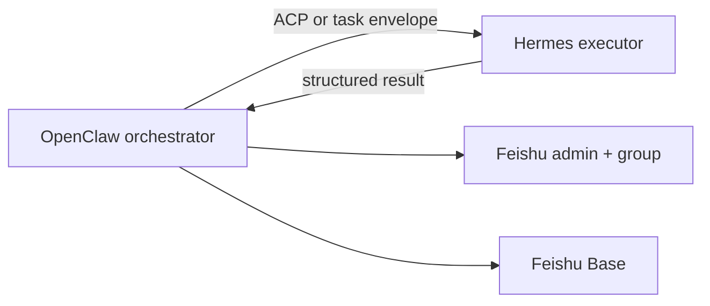

# Platform Adapters

This skill runs on multiple agent platforms. The loop contract stays the same; only scheduling, state storage, and subagent dispatch differ.

## Supported Platforms

| Platform | Role | Strength |
| --- | --- | --- |
| `openclaw` | Orchestrator | Cron, skills, Feishu connectors, isolated sessions, team deployment |
| `hermes` | Executor | Long-horizon execution, reflective skill accumulation, repetitive sub-loops |
| `claude` | Standalone / IDE | Claude Code skills, `/loop`, `/goal`, subagent Task tool |
| `cursor` | Cloud / IDE agent | Scheduled cloud tasks, PR workflow, subagent Task tool |
| `codex` | Standalone / IDE | Automations, worktrees, `/goal` stop conditions |

Set `AI_NEWS_PLATFORM` to the active runtime. Default: `openclaw`.

## Recommended Hybrid Topology



Use OpenClaw when you need scheduling, approval routing, and Feishu delivery. Delegate repetitive execution slices to Hermes when the same source set and ranking pattern repeat daily.

## OpenClaw Adapter

**When to use:** production cron, multi-user Feishu approval, deterministic script execution on a fixed host.

**Install:**

```bash
openclaw skills install /path/to/ai-news --as ai-news --agent ops --force
```

**Cron:**

```bash
openclaw cron create "0 9 * * *" \
  'Use $ai-news to run the Horizon-style daily AI news loop. Persist loop_state.json, use scripts for deterministic stages, atomic subagents for fetch/score/enrich/draft/review. Stop at approval until admin confirms payload_hash. Archive to Feishu Base before publish.' \
  --name "AI News Daily" \
  --agent ops \
  --session isolated \
  --no-deliver
```

**Runtime duties:**

- Call `scripts/normalize_run_context.py` with `AI_NEWS_PLATFORM=openclaw`.
- Read/write `data/runs/<job_id>/loop_state.json` on every stage transition.
- Route subagents through OpenClaw subagent tools or labeled isolated passes.
- Keep secrets in OpenClaw secret manager, not prompts.

**State path:** `data/runs/<job_id>/loop_state.json` on the OpenClaw host.

## Hermes Adapter

**When to use:** execution-heavy slices that benefit from reflective skill accumulation — source collection patterns, ranking heuristics, enrichment prompts.

**Contract:**

- OpenClaw (or Claude) remains the orchestrator and approval gate.
- Hermes receives a bounded task envelope, not the full run history.
- Hermes returns structured JSON only; it does not publish to Feishu directly.

**Envelope fields for Hermes dispatch:**

```json
{
  "job_id": "string",
  "executor": "hermes",
  "role": "source_collector|dedupe_ranker|industry_analyst",
  "run_context": {},
  "source_policy": {},
  "output_schema": "references/subagent-contracts.md#source-collector",
  "loop_state_ref": "data/runs/<job_id>/loop_state.json"
}
```

**Reflective phase (optional):**

After a successful daily run, Hermes may write a procedural skill snippet into its own skill library. Do not let Hermes mutate this skill's deterministic scripts or approval gates. Only cache source-ranking heuristics and search patterns.

**Inter-agent transport:** prefer ACP when both runtimes are available; otherwise use file-based JSON handoff in `data/runs/<job_id>/handoffs/`.

## Claude Code Adapter

**When to use:** individual developer machines, `/loop` or `/goal` driven daily briefing without OpenClaw.

**Setup:**

1. Install this directory as a Claude Code skill.
2. Export Feishu and AI provider env vars in the shell or `.env`.
3. Use isolated context per run.

**Loop modes:**

| Mode | Command pattern | Stop condition |
| --- | --- | --- |
| Scheduled | `/loop 24h Use $ai-news ...` | `loop_state.stage == completed` |
| Goal-driven | `/goal` with verifier | `validate_news_payload.py` ok + admin approval + publish message_id |

**Subagents:** use Claude Code `Task` tool with readonly or generalPurpose subagents matching roles in [subagent-contracts.md](subagent-contracts.md).

**Maker-checker:** the same agent must not skip `quality_reviewer`. Use a separate Task subagent for review.

## Cursor Cloud Agent Adapter

**When to use:** repo-integrated scheduled runs, PR-based workflow changes, cloud VM with network access.

**Setup:**

- Place skill at repo root or `skills/ai-news/`.
- Configure secrets in Cursor cloud environment variables.
- Use cloud task scheduling or manual agent invocation.

**Differences from Claude Code:**

- Branch and PR workflow for skill changes.
- `block_until_ms` and tmux for long-running script tests.
- Subagent dispatch via Cursor `Task` tool.

**Platform value:**

```bash
export AI_NEWS_PLATFORM=cursor
scripts/normalize_run_context.py
```

## Codex Adapter

**When to use:** OpenAI Codex app automations, background worktrees, triage-style loops.

**Automation prompt template:**

```text
Use $ai-news to advance the daily AI news loop for job_id <id>.
Read loop_state.json, run the next incomplete stage, verify with scripts, persist state.
Stop when stage is completed or max_iterations exceeded.
```

**`/goal` stop condition example:**

```text
loop_state.stage == "completed" AND publish_message_id is not null
```

## AI Provider Matrix

Subagents use the provider configured in `data/config.json` or platform defaults:

```json
{
  "ai": {
    "provider": "anthropic",
    "model": "claude-sonnet-4-20250514",
    "api_key_env": "ANTHROPIC_API_KEY",
    "temperature": 0.3
  }
}
```

Supported provider values mirror Horizon:

`anthropic`, `openai`, `gemini`, `deepseek`, `doubao`, `minimax`, `ollama`, `azure`

OpenAI-compatible endpoints use `base_url` + `api_key_env`.

## Tool Name Mapping

| Concept | OpenClaw | Claude Code | Cursor | Hermes |
| --- | --- | --- | --- | --- |
| Load skill | `$ai-news` | `Skill` tool | skill file read | skill mount |
| Subagent | subagent tool | `Task` | `Task` | ACP delegate |
| Schedule | `openclaw cron` | `/loop` | cloud task | scheduler |
| Memory query | `query_memory.py` | `query_memory.py` | `query_memory.py` | `query_memory.py` |
| Durable state | `loop_state.py` | `loop_state.py` | `loop_state.py` | `loop_state.py` |

## Security By Platform

| Risk | Mitigation |
| --- | --- |
| Hermes self-written skills bypass approval | Orchestrator owns approval and publish; Hermes cannot call publish scripts |
| Claude/Cursor context overflow | `query_memory.py` with `--top-k 3`; persist artifacts to `loop_state.json` |
| OpenClaw session bleed | `--session isolated` on cron |
| Cross-platform hash mismatch | always use `scripts/hash_payload.py` on canonical JSON |

## Minimal Cross-Platform Run

```bash
export AI_NEWS_PLATFORM=openclaw  # or claude, cursor, hermes
export FEISHU_NEWS_ADMIN_ID=ou_xxx
export FEISHU_GROUP_CHAT_ID=oc_xxx
export FEISHU_BASE_APP_TOKEN=base_xxx
export FEISHU_BASE_TABLE_ID=tbl_xxx

scripts/normalize_run_context.py | tee /tmp/run-context.json
JOB_ID=$(jq -r '.run_context.job_id' /tmp/run-context.json)
scripts/loop_state.py init --job-id "$JOB_ID" --platform "$AI_NEWS_PLATFORM"
```

Then let the main agent advance stages until `loop_state.stage` is `completed`.
